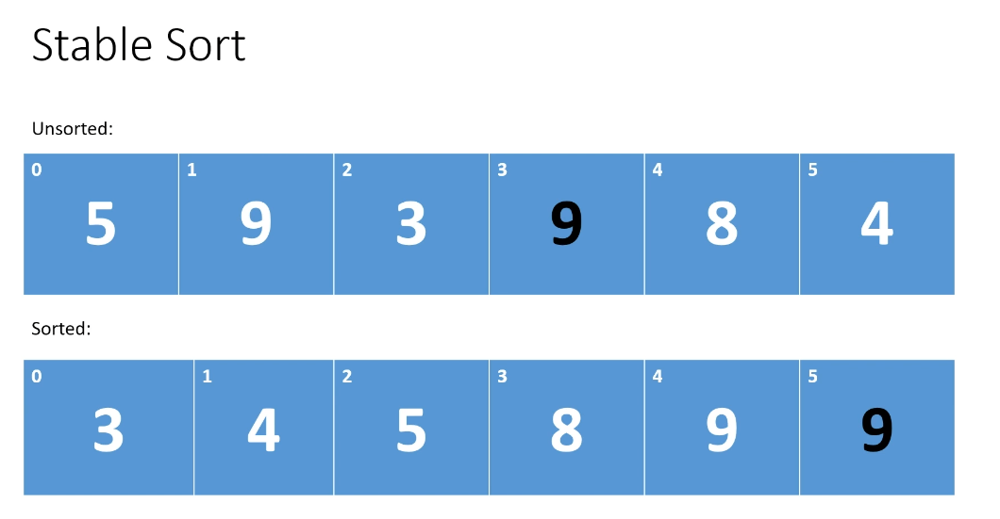

# Stable vs Unstable Sort

## Unstable Sort

**Unstable Sort - Unsorted Array**

**Unstable Sort - Sorted Array**

## Stable Sort

The relative order of duplicated elements are preserved

**Unsorted array**

**Sorted array**

Ex.:

- Bubble Sort is an exemple of Stable sort algorithm: We move the element to the end of array whether _i+1_ element is greater than _i_ element
